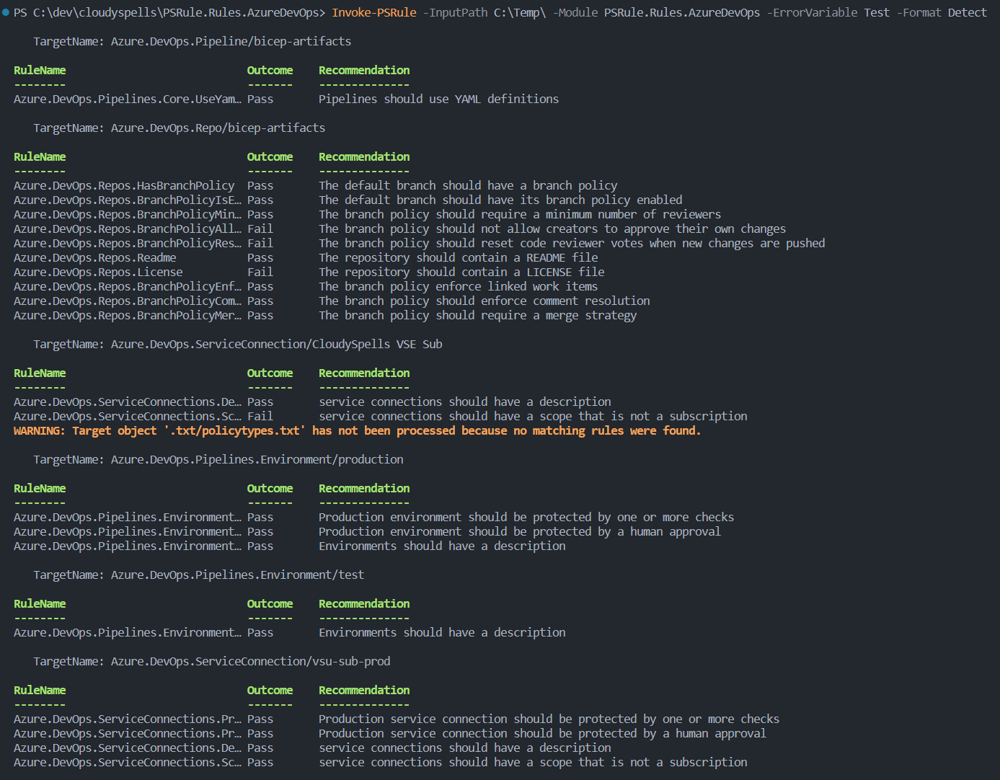

# PSRule.Rules.AzureDevOps

## Azure DevOps rules module for PSRule

This powershell module is built to be used with
[Bernie White's](https://github.com/BernieWhite) excellent
[PSRule](https://github.com/microsoft/PSRule) module to check
an Azure DevOps project against some best practices for a
secure development environment.

This module is very much in early stage of development and
should not be considered stable. Any input on the direction
of the module and included rules is very much appreciated.
Please consider opening an issue with your ideas.



## Usage

To use this module, you need to have _PSRule_ installed.
You can install it from the PowerShell Gallery:

```powershell
Install-Module -Name PSRule -Scope CurrentUser
```

Once you have PSRule installed, you can install this module
from the PowerShell Gallery:

```powershell
Install-Module -Name PSRule.Rules.AzureDevOps -Scope CurrentUser
```

Once you have both modules installed, you can run an export of
your Azure DevOps project and run the rules against it. The `-PAT`
value needs to be an Azure DevOps Personal Access Token with
sufficient permissions to read the project data.

```powershell
$export = Export-AzDevOpsRuleData `
    -Organization "MyOrg" `
    -Project "MyProject" `
    -PAT $MyPAT `
    -OutputPath "C:\Temp\MyProject"
Assert-PSRule `
    -InputPath "C:\Temp\MyProject" `
    -Module PSRule.Rules.AzureDevOps
```

## Rules

Documentation for the implemented rules can be found in the
[en-US](src/PSRule.Rules.AzureDevOps/en-US) folder.

- [Azure.DevOps.Pipelines.Core.UseYaml](src/PSRule.Rules.AzureDevOps/en-US/Azure.DevOps.Pipelines.Core.UseYaml.md)
- [Azure.DevOps.Pipelines.Environments.Description](src/PSRule.Rules.AzureDevOps/en-US/Azure.DevOps.Pipelines.Environments.Description.md)
- [Azure.DevOps.Pipelines.Environments.ProductionCheckProtection](src/PSRule.Rules.AzureDevOps/en-US/Azure.DevOps.Pipelines.Environments.ProductionCheckProtection.md)
- [Azure.DevOps.Pipelines.Environments.ProductionHumanApproval](src/PSRule.Rules.AzureDevOps/en-US/Azure.DevOps.Pipelines.Environments.ProductionHumanApproval.md)
- [Azure.DevOps.Repos.BranchPolicyAllowSelfApproval](src/PSRule.Rules.AzureDevOps/en-US/Azure.DevOps.Repos.BranchPolicyAllowSelfApproval.md)
- [Azure.DevOps.Repos.BranchPolicyCommentResolution](src/PSRule.Rules.AzureDevOps/en-US/Azure.DevOps.Repos.BranchPolicyCommentResolution.md)
- [Azure.DevOps.Repos.BranchPolicyEnforceLinkedWorkItems](src/PSRule.Rules.AzureDevOps/en-US/Azure.DevOps.Repos.BranchPolicyEnforceLinkedWorkItems.md)
- [Azure.DevOps.Repos.BranchPolicyIsEnabled](src/PSRule.Rules.AzureDevOps/en-US/Azure.DevOps.Repos.BranchPolicyIsEnabled.md)
- [Azure.DevOps.Repos.BranchPolicyMergeStrategy](src/PSRule.Rules.AzureDevOps/en-US/Azure.DevOps.Repos.BranchPolicyMergeStrategy.md)
- [Azure.DevOps.Repos.BranchPolicyMinimumReviewers](src/PSRule.Rules.AzureDevOps/en-US/Azure.DevOps.Repos.BranchPolicyMinimumReviewers.md)
- [Azure.DevOps.Repos.BranchPolicyResetVotes](src/PSRule.Rules.AzureDevOps/en-US/Azure.DevOps.Repos.BranchPolicyResetVotes.md)
- [Azure.DevOps.Repos.HasBranchPolicy](src/PSRule.Rules.AzureDevOps/en-US/Azure.DevOps.Repos.HasBranchPolicy.md)
- [Azure.DevOps.Repos.License](src/PSRule.Rules.AzureDevOps/en-US/Azure.DevOps.Repos.License.md)
- [Azure.DevOps.Repos.Readme](src/PSRule.Rules.AzureDevOps/en-US/Azure.DevOps.Repos.Readme.md)
- [Azure.DevOps.ServiceConnections.Description](src/PSRule.Rules.AzureDevOps/en-US/Azure.DevOps.ServiceConnections.Description.md)
- [Azure.DevOps.ServiceConnections.ProductionCheckProtection](src/PSRule.Rules.AzureDevOps/en-US/Azure.DevOps.ServiceConnections.ProductionCheckProtection.md)
- [Azure.DevOps.ServiceConnections.ProductionHumanApproval](src/PSRule.Rules.AzureDevOps/en-US/Azure.DevOps.ServiceConnections.ProductionHumanApproval.md)
- [Azure.DevOps.ServiceConnections.Scope](src/PSRule.Rules.AzureDevOps/en-US/Azure.DevOps.ServiceConnections.Scope.md)
