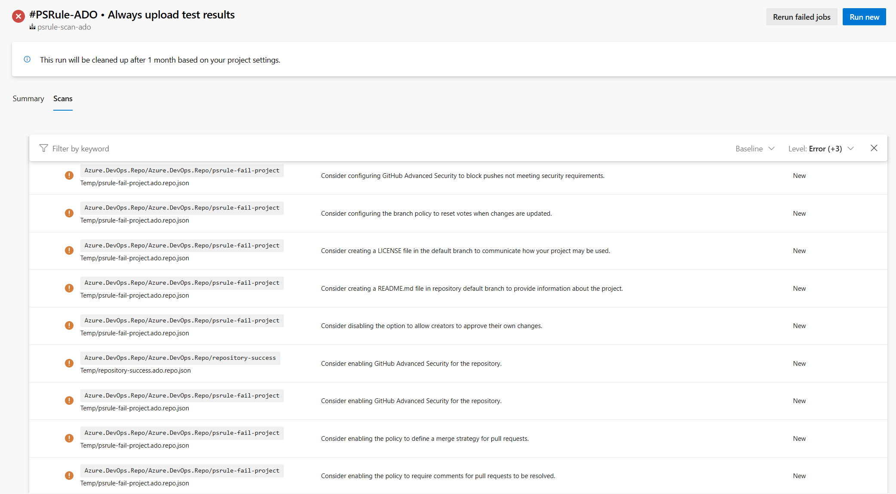

# PSRule.Rules.AzureDevOps

[](https://www.powershellgallery.com/packages/PSRule.Rules.AzureDevOps)
[](https://www.powershellgallery.com/packages/PSRule.Rules.AzureDevOps)
[](https://github.com/cloudyspells/PSRule.Rules.AzureDevOps/actions/workflows/module-ci.yml)
[](https://codecov.io/gh/cloudyspells/PSRule.Rules.AzureDevOps)

## PSRule Module for Azure DevOps

This powershell module is built to be used with
[Bernie White's](https://github.com/BernieWhite) excellent
[PSRule](https://github.com/microsoft/PSRule) module to check
an Azure DevOps project for best practices for a
secure development environment. The module takes best practices from the official
[Azure DevOps Security best practices](https://learn.microsoft.com/en-us/azure/devops/organizations/security/security-best-practices?view=azure-devops) documentation. It can
function as a periodic security scan and check for your Azure DevOps project.

This module is actively developed since August 2023. Although a lot of testing has been
performed and is built in to the development cycle, up to now little feedback has come
back from the community yet. Any input on the direction of the module and included rules
is very much appreciated. Please consider opening an
[issue](https://github.com/cloudyspells/PSRule.Rules.AzureDevOps/issues)
with your ideas, encountered problems in using the module or other contributions. Any
feedback is highly appreciated.



### Easy to use spin-off project

If you are looking for an easy to use spin-off project that uses this module and
gives you a nice dashboard in Azure Monitor, please have a look at the
[PsrAzDo-workbooks](https://github.com/cloudyspells/PsrAzDo-workbooks) project.
It is a set of Azure Monitor Workbooks that can be used to visualize the results
of the PSRule.Rules.AzureDevOps module. The workbooks are easily deployed through
through the included Bicep template and modules. A Yaml pipeline is included to
run the PSRule.Rules.AzureDevOps module on a daily basis and upload the results
to Azure Monitor.

## Usage

To use this module, you need to have _PSRule_ installed.
You can install it from the PowerShell Gallery:

```powershell
Install-Module -Name PSRule -Scope CurrentUser
```

Once you have PSRule installed, you can install this module
from the PowerShell Gallery:

```powershell
Install-Module -Name PSRule.Rules.AzureDevOps -Scope CurrentUser
```

### PAT Token

Once you have both modules installed, you can connect to your
Azure DevOps organization and run an export of your Azure DevOps
project and run the rules on the exported data.
The `-PAT` value needs to be an Azure DevOps Personal Access Token
with sufficient permissions to read the project data. The default
expects a PAT with full access permissions. Alternately, you can
use a PAT with only read permissions or fine-grained permissions
with the `-TokenType` parameter. The fine-grained permissions expect
read access to all scopes and read & manage for scope that do not
have read-only access. Documentation on how to create the PATs can
be found in the [docs/token-permissions.md](docs/token-permissions.md).

#### Example: Run with full access token

```powershell
Connect-AzDevOps `
    -Organization "MyOrg" `
    -PAT $MyPAT
Export-AzDevOpsRuleData `
    -Project "MyProject" `
    -OutputPath "C:\Temp\MyProject"
Assert-PSRule `
    -InputPath "C:\Temp\MyProject\" `
    -Module PSRule.Rules.AzureDevOps
```

#### Example: Run with read-only access token

```powershell
Connect-AzDevOps `
    -Organization "MyOrg" `
    -PAT $MyPAT `
    -TokenType ReadOnly
Export-AzDevOpsRuleData `
    -Project "MyProject" `
    -OutputPath "C:\Temp\MyProject"
Assert-PSRule `
    -InputPath "C:\Temp\MyProject\" `
    -Module PSRule.Rules.AzureDevOps
```

### Service Principal or Managed Identity

Since version 0.3.0 of this module, you can also connect to your
Azure DevOps organization with a Service Principal or Managed Identity.
The `-AuthType` parameter can be set to `ServicePrincipal` or `ManagedIdentity`.
The Service Principal needs to have sufficient permissions to read the
project data. The default expects a Service Principal with project
administrator permissions. Alternately, you can use a Service Principal
with only read permissions or fine-grained permissions with the `-TokenType`
parameter.

#### Example: Run with a Service Principal

```powershell
Connect-AzDevOps `
    -Organization "MyOrg" `
    -AuthType ServicePrincipal `
    -ClientId $MyAppId `
    -ClientSecret $MyAppSecret `
    -TenantId $MyTenantId
Export-AzDevOpsRuleData `
    -Project "MyProject" `
    -OutputPath "C:\Temp\MyProject"
Assert-PSRule `
    -InputPath "C:\Temp\MyProject\" `
    -Module PSRule.Rules.AzureDevOps
```

#### Example: Run with a System Assigned Managed Identity

```powershell
Connect-AzDevOps `
    -Organization "MyOrg" `
    -AuthType ManagedIdentity
Export-AzDevOpsRuleData `
    -Project "MyProject" `
    -OutputPath "C:\Temp\MyProject"
Assert-PSRule `
    -InputPath "C:\Temp\MyProject\" `
    -Module PSRule.Rules.AzureDevOps
```

#### Example: Run with a User Assigned Managed Identity

```powershell
$env:ADO_MSI_CLIENT_ID = $MyClientId
Connect-AzDevOps `
    -Organization "MyOrg" `
    -AuthType ManagedIdentity `
Export-AzDevOpsRuleData `
    -Project "MyProject" `
    -OutputPath "C:\Temp\MyProject"
Assert-PSRule `
    -InputPath "C:\Temp\MyProject\" `
    -Module PSRule.Rules.AzureDevOps
```


### Organization level export

Since version 0.0.8 of this module, you can also export the
data at the organization level, looping through all projects
in the organization the PAT has access to.

```powershell
Export-AzDevOpsOrganizationRuleData `
    -OutputPath "C:\Temp\MyOrg"
```

### Disable checks for Azure DevOps Features that require additional licenses

Since version 0.0.12 of this module, you can disable rules that
check for Azure DevOps features that require additional licenses.
This is done through applying the `Baseline.NoExtraLicense`
baseline to the `Assert-PSRule` command through the `-Baseline`
option.

```powershell
Assert-PSRule `
    -InputPath "C:\Temp\MyProject\" `
    -Module PSRule.Rules.AzureDevOps `
    -Baseline Baseline.NoExtraLicense
```

## Rules

Documentation for the implemented rules can be found in the
[en](src/PSRule.Rules.AzureDevOps/en/) folder in the module folder.

This [annotated version of the official security best practices](docs/security-best-practices.md)
provides a reference for how the rules in this module are related to the
best practices recommended by Microsoft. It is the main guiding document
in building the ruleset for this module.

### Implemented rules

- [Azure.DevOps.Groups.ProjectAdmins.MaxMembers](src/PSRule.Rules.AzureDevOps/en/Azure.DevOps.Groups.ProjectAdmins.MaxMembers.md)
- [Azure.DevOps.Groups.ProjectAdmins.MinMembers](src/PSRule.Rules.AzureDevOps/en/Azure.DevOps.Groups.ProjectAdmins.MinMembers.md)
- [Azure.DevOps.Groups.ProjectValidUsers.DoNotAssignMemberOfOtherGroups](src/PSRule.Rules.AzureDevOps/en/Azure.DevOps.Groups.ProjectValidUsers.DoNotAssignMemberOfOtherGroups.md)
- [Azure.DevOps.Pipelines.Core.InheritedPermissions](src/PSRule.Rules.AzureDevOps/en/Azure.DevOps.Pipelines.Core.InheritedPermissions.md)
- [Azure.DevOps.Pipelines.Core.NoPlainTextSecrets](src/PSRule.Rules.AzureDevOps/en/Azure.DevOps.Pipelines.Core.NoPlainTextSecrets.md)
- [Azure.DevOps.Pipelines.Core.ProjectValidUsers](src/PSRule.Rules.AzureDevOps/en/Azure.DevOps.Pipelines.Core.ProjectValidUsers.md)
- [Azure.DevOps.Pipelines.Core.UseYamlDefinition](src/PSRule.Rules.AzureDevOps/en/Azure.DevOps.Pipelines.Core.UseYamlDefinition.md)
- [Azure.DevOps.Pipelines.Environments.Description](src/PSRule.Rules.AzureDevOps/en/Azure.DevOps.Pipelines.Environments.Description.md)
- [Azure.DevOps.Pipelines.Environments.InheritedPermissions](src/PSRule.Rules.AzureDevOps/en/Azure.DevOps.Pipelines.Environments.InheritedPermissions.md)
- [Azure.DevOps.Pipelines.Environments.ProductionBranchLimit](src/PSRule.Rules.AzureDevOps/en/Azure.DevOps.Pipelines.Environments.ProductionBranchLimit.md)
- [Azure.DevOps.Pipelines.Environments.ProductionCheckProtection](src/PSRule.Rules.AzureDevOps/en/Azure.DevOps.Pipelines.Environments.ProductionCheckProtection.md)
- [Azure.DevOps.Pipelines.Environments.ProductionHumanApproval](src/PSRule.Rules.AzureDevOps/en/Azure.DevOps.Pipelines.Environments.ProductionHumanApproval.md)
- [Azure.DevOps.Pipelines.Environments.ProjectValidUsers](src/PSRule.Rules.AzureDevOps/en/Azure.DevOps.Pipelines.Environments.ProjectValidUsers.md)
- [Azure.DevOps.Pipelines.PipelineYaml.AgentPoolVersionNotLatest](src/PSRule.Rules.AzureDevOps/en/Azure.DevOps.Pipelines.PipelineYaml.AgentPoolVersionNotLatest.md)
- [Azure.DevOps.Pipelines.PipelineYaml.StepDisplayName](src/PSRule.Rules.AzureDevOps/en/Azure.DevOps.Pipelines.PipelineYaml.StepDisplayName.md)
- [Azure.DevOps.Pipelines.Releases.Definition.InheritedPermissions](src/PSRule.Rules.AzureDevOps/en/Azure.DevOps.Pipelines.Releases.Definition.InheritedPermissions.md)
- [Azure.DevOps.Pipelines.Releases.Definition.NoPlainTextSecrets](src/PSRule.Rules.AzureDevOps/en/Azure.DevOps.Pipelines.Releases.Definition.NoPlainTextSecrets.md)
- [Azure.DevOps.Pipelines.Releases.Definition.ProductionApproval](src/PSRule.Rules.AzureDevOps/en/Azure.DevOps.Pipelines.Releases.Definition.ProductionApproval.md)
- [Azure.DevOps.Pipelines.Releases.Definition.ProjectValidUsers](src/PSRule.Rules.AzureDevOps/en/Azure.DevOps.Pipelines.Releases.Definition.ProjectValidUsers.md)
- [Azure.DevOps.Pipelines.Releases.Definition.SelfApproval](src/PSRule.Rules.AzureDevOps/en/Azure.DevOps.Pipelines.Releases.Definition.SelfApproval.md)
- [Azure.DevOps.Pipelines.Settings.LimitJobAuthorizationScope](src/PSRule.Rules.AzureDevOps/en/Azure.DevOps.Pipelines.Settings.LimitJobAuthorizationScope.md)
- [Azure.DevOps.Pipelines.Settings.LimitJobAuthorizationScopeForReleasePipelines](src/PSRule.Rules.AzureDevOps/en/Azure.DevOps.Pipelines.Settings.LimitJobAuthorizationScopeForReleasePipelines.md)
- [Azure.DevOps.Pipelines.Settings.LimitJobAuthorizationScopeForYamlPipelines](src/PSRule.Rules.AzureDevOps/en/Azure.DevOps.Pipelines.Settings.LimitJobAuthorizationScopeForYamlPipelines.md)
- [Azure.DevOps.Pipelines.Settings.LimitSetVariablesAtQueueTime](src/PSRule.Rules.AzureDevOps/en/Azure.DevOps.Pipelines.Settings.LimitSetVariablesAtQueueTime.md)
- [Azure.DevOps.Pipelines.Settings.RequireCommentForPullRequestFromFork](src/PSRule.Rules.AzureDevOps/en/Azure.DevOps.Pipelines.Settings.RequireCommentForPullRequestFromFork.md)
- [Azure.DevOps.Pipelines.Settings.RestrictSecretsForPullRequestFromFork](src/PSRule.Rules.AzureDevOps/en/Azure.DevOps.Pipelines.Settings.RestrictSecretsForPullRequestFromFork.md)
- [Azure.DevOps.Pipelines.Settings.SanitizeShellTaskArguments](src/PSRule.Rules.AzureDevOps/en/Azure.DevOps.Pipelines.Settings.SanitizeShellTaskArguments.md)
- [Azure.DevOps.Pipelines.Settings.StatusBadgesPrivate](src/PSRule.Rules.AzureDevOps/en/Azure.DevOps.Pipelines.Settings.StatusBadgesPrivate.md)
- [Azure.DevOps.Project.MainEnvironmentAcl.ProjectValidUsers](src/PSRule.Rules.AzureDevOps/en/Azure.DevOps.Project.MainEnvironmentAcl.ProjectValidUsers.md)
- [Azure.DevOps.Project.MainPipelineAcl.ProjectValidUsers](src/PSRule.Rules.AzureDevOps/en/Azure.DevOps.Project.MainPipelineAcl.ProjectValidUsers.md)
- [Azure.DevOps.Project.MainReleaseDefinitionAcl.ProjectValidUsers](src/PSRule.Rules.AzureDevOps/en/Azure.DevOps.Project.MainReleaseDefinitionAcl.ProjectValidUsers.md)
- [Azure.DevOps.Project.MainRepositoryAcl.ProjectValidUsers](src/PSRule.Rules.AzureDevOps/en/Azure.DevOps.Project.MainRepositoryAcl.ProjectValidUsers.md)
- [Azure.DevOps.Project.MainServiceConnectionAcl.ProjectValidUsers](src/PSRule.Rules.AzureDevOps/en/Azure.DevOps.Project.MainServiceConnectionAcl.ProjectValidUsers.md)
- [Azure.DevOps.Project.MainVariableGroupAcl.ProjectValidUsers](src/PSRule.Rules.AzureDevOps/en/Azure.DevOps.Project.MainVariableGroupAcl.ProjectValidUsers.md)
- [Azure.DevOps.Project.Visibility]
- [Azure.DevOps.Repos.Branch.BranchPolicyAllowSelfApproval](src/PSRule.Rules.AzureDevOps/en/Azure.DevOps.Repos.Branch.BranchPolicyAllowSelfApproval.md)
- [Azure.DevOps.Repos.Branch.BranchPolicyCommentResolution](src/PSRule.Rules.AzureDevOps/en/Azure.DevOps.Repos.Branch.BranchPolicyCommentResolution.md)
- [Azure.DevOps.Repos.Branch.BranchPolicyEnforceLinkedWorkItems](src/PSRule.Rules.AzureDevOps/en/Azure.DevOps.Repos.Branch.BranchPolicyEnforceLinkedWorkItems.md)
- [Azure.DevOps.Repos.Branch.BranchPolicyIsEnabled](src/PSRule.Rules.AzureDevOps/en/Azure.DevOps.Repos.Branch.BranchPolicyIsEnabled.md)
- [Azure.DevOps.Repos.Branch.BranchPolicyMergeStrategy](src/PSRule.Rules.AzureDevOps/en/Azure.DevOps.Repos.Branch.BranchPolicyMergeStrategy.md)
- [Azure.DevOps.Repos.Branch.BranchPolicyMinimumReviewers](src/PSRule.Rules.AzureDevOps/en/Azure.DevOps.Repos.Branch.BranchPolicyMinimumReviewers.md)
- [Azure.DevOps.Repos.Branch.BranchPolicyRequireBuild](src/PSRule.Rules.AzureDevOps/en/Azure.DevOps.Repos.Branch.BranchPolicyRequireBuild.md)
- [Azure.DevOps.Repos.Branch.BranchPolicyResetVotes](src/PSRule.Rules.AzureDevOps/en/Azure.DevOps.Repos.Branch.BranchPolicyResetVotes.md)
- [Azure.DevOps.Repos.Branch.HasBranchPolicy](src/PSRule.Rules.AzureDevOps/en/Azure.DevOps.Repos.Branch.HasBranchPolicy.md)
- [Azure.DevOps.Repos.DefaultBranchPolicyAllowSelfApproval](src/PSRule.Rules.AzureDevOps/en/Azure.DevOps.Repos.DefaultBranchPolicyAllowSelfApproval.md)
- [Azure.DevOps.Repos.DefaultBranchPolicyCommentResolution](src/PSRule.Rules.AzureDevOps/en/Azure.DevOps.Repos.DefaultBranchPolicyCommentResolution.md)
- [Azure.DevOps.Repos.DefaultBranchPolicyEnforceLinkedWorkItems](src/PSRule.Rules.AzureDevOps/en/Azure.DevOps.Repos.DefaultBranchPolicyEnforceLinkedWorkItems.md)
- [Azure.DevOps.Repos.DefaultBranchPolicyIsEnabled](src/PSRule.Rules.AzureDevOps/en/Azure.DevOps.Repos.DefaultBranchPolicyIsEnabled.md)
- [Azure.DevOps.Repos.DefaultBranchPolicyMergeStrategy](src/PSRule.Rules.AzureDevOps/en/Azure.DevOps.Repos.DefaultBranchPolicyMergeStrategy.md)
- [Azure.DevOps.Repos.DefaultBranchPolicyMinimumReviewers](src/PSRule.Rules.AzureDevOps/en/Azure.DevOps.Repos.DefaultBranchPolicyMinimumReviewers.md)
- [Azure.DevOps.Repos.DefaultBranchPolicyRequireBuild](src/PSRule.Rules.AzureDevOps/en/Azure.DevOps.Repos.DefaultBranchPolicyRequireBuild.md)
- [Azure.DevOps.Repos.DefaultBranchPolicyResetVotes](src/PSRule.Rules.AzureDevOps/en/Azure.DevOps.Repos.DefaultBranchPolicyResetVotes.md)
- [Azure.DevOps.Repos.GitHubAdvancedSecurityBlockPushes](src/PSRule.Rules.AzureDevOps/en/Azure.DevOps.Repos.GitHubAdvancedSecurityBlockPushes.md)
- [Azure.DevOps.Repos.GitHubAdvancedSecurityEnabled](src/PSRule.Rules.AzureDevOps/en/Azure.DevOps.Repos.GitHubAdvancedSecurityEnabled.md)
- [Azure.DevOps.Repos.HasDefaultBranchPolicy](src/PSRule.Rules.AzureDevOps/en/Azure.DevOps.Repos.HasDefaultBranchPolicy.md)
- [Azure.DevOps.Repos.InheritedPermissions](src/PSRule.Rules.AzureDevOps/en/Azure.DevOps.Repos.InheritedPermissions.md)
- [Azure.DevOps.Repos.License](src/PSRule.Rules.AzureDevOps/en/Azure.DevOps.Repos.License.md)
- [Azure.DevOps.Repos.ProjectValidUsers](src/PSRule.Rules.AzureDevOps/en/Azure.DevOps.Repos.ProjectValidUsers.md)
- [Azure.DevOps.Repos.Readme](src/PSRule.Rules.AzureDevOps/en/Azure.DevOps.Repos.Readme.md)
- [Azure.DevOps.RetentionSettings.ArtifactMinimumRetentionDays](src/PSRule.Rules.AzureDevOps/en/Azure.DevOps.RetentionSettings.ArtifactMinimumRetentionDays.md)
- [Azure.DevOps.RetentionSettings.PullRequestRunsMinimumRetentionDays](src/PSRule.Rules.AzureDevOps/en/Azure.DevOps.RetentionSettings.PullRequestRunsMinimumRetentionDays.md)
- [Azure.DevOps.ServiceConnections.ClassicAzure](src/PSRule.Rules.AzureDevOps/en/Azure.DevOps.ServiceConnections.ClassicAzure.md)
- [Azure.DevOps.ServiceConnections.Description](src/PSRule.Rules.AzureDevOps/en/Azure.DevOps.ServiceConnections.Description.md)
- [Azure.DevOps.ServiceConnections.GitHubPAT](src/PSRule.Rules.AzureDevOps/en/Azure.DevOps.ServiceConnections.GitHubPAT.md)
- [Azure.DevOps.ServiceConnections.InheritedPermissions](src/PSRule.Rules.AzureDevOps/en/Azure.DevOps.ServiceConnections.InheritedPermissions.md)
- [Azure.DevOps.ServiceConnections.ProductionBranchLimit](src/PSRule.Rules.AzureDevOps/en/Azure.DevOps.ServiceConnections.ProductionBranchLimit.md)
- [Azure.DevOps.ServiceConnections.ProductionCheckProtection](src/PSRule.Rules.AzureDevOps/en/Azure.DevOps.ServiceConnections.ProductionCheckProtection.md)
- [Azure.DevOps.ServiceConnections.ProductionHumanApproval](src/PSRule.Rules.AzureDevOps/en/Azure.DevOps.ServiceConnections.ProductionHumanApproval.md)
- [Azure.DevOps.ServiceConnections.ProjectValidUsers](src/PSRule.Rules.AzureDevOps/en/Azure.DevOps.ServiceConnections.ProjectValidUsers.md)
- [Azure.DevOps.ServiceConnections.Scope](src/PSRule.Rules.AzureDevOps/en/Azure.DevOps.ServiceConnections.Scope.md)
- [Azure.DevOps.ServiceConnections.WorkloadIdentityFederation](src/PSRule.Rules.AzureDevOps/en/Azure.DevOps.ServiceConnections.WorkloadIdentityFederation.md)
- [Azure.DevOps.Tasks.VariableGroup.Description](src/PSRule.Rules.AzureDevOps/en/Azure.DevOps.Tasks.VariableGroup.Description.md)
- [Azure.DevOps.Tasks.VariableGroup.InheritedPermissions](src/PSRule.Rules.AzureDevOps/en/Azure.DevOps.Tasks.VariableGroup.InheritedPermissions.md)
- [Azure.DevOps.Tasks.VariableGroup.NoKeyVaultNoSecrets](src/PSRule.Rules.AzureDevOps/en/Azure.DevOps.Tasks.VariableGroup.NoKeyVaultNoSecrets.md)
- [Azure.DevOps.Tasks.VariableGroup.NoPlainTextSecrets](src/PSRule.Rules.AzureDevOps/en/Azure.DevOps.Tasks.VariableGroup.NoPlainTextSecrets.md)
- [Azure.DevOps.Tasks.VariableGroup.ProjectValidUsers](src/PSRule.Rules.AzureDevOps/en/Azure.DevOps.Tasks.VariableGroup.ProjectValidUsers.md)

## Contributing

This project welcomes contributions and suggestions. Please read
[CONTRIBUTING.md](CONTRIBUTING.md) for details on how to contribute.

## License

This project is [licensed under the MIT License](LICENSE).

## Acknowledgements

- [Bernie White](https://github.com/BernieWhite) for creating
  [PSRule](https://microsoft.github.io/PSRule/V2).

## Maintainer

- [Roderick Bant](https://github.com/webtonize)

## References

- [PSRule](https://microsoft.github.io/PSRule/V2)
- [PsrAzDo-workbooks](https://github.com/cloudyspells/PsrAzDo-workbooks) - Azure Monitor Workbooks for PSRule.Rules.AzureDevOps
- [Auditing an Azure DevOps project configuration with PSRule](https://medium.com/@webtonize/auditing-an-azure-devops-project-configuration-with-psrule-73cf17753827)
- [Audit Azure DevOps configuration with Sarif scan reports from the pipeline](https://medium.com/@webtonize/audit-azure-devops-configuration-with-sarif-scan-reports-from-the-pipeline-4ced6fc47988)
- [Azure DevOps Security best practices](https://learn.microsoft.com/en-us/azure/devops/organizations/security/security-best-practices?view=azure-devops)
